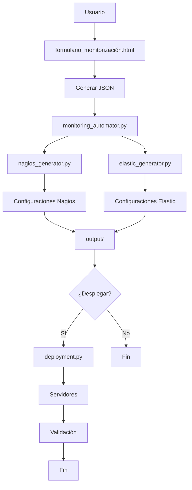

# Sistema de Automatización de Monitorización

🚀 **Sistema completo para automatizar la configuración y despliegue de Nagios y Elastic Stack basado en formularios JSON**

## 🆕 Novedades v1.1 - Despliegue Automático

- ✅ **Despliegue automático** de configuraciones a servidores
- ✅ **Archivo de configuración separado** (`config.yml`) para infraestructura
- ✅ **Soporte multi-entorno** (production, staging, development)
- ✅ **Backup automático** antes de despliegues
- ✅ **Validación post-despliegue** de servicios
- ✅ **Notificaciones** por email/Slack
- ✅ **Modo dry-run** para pruebas seguras

## 📋 Descripción General

Este sistema permite generar automáticamente configuraciones completas de monitorización para:

- **Nagios**: Hosts, servicios, contactos y comandos de chequeo
- **Elastic Stack**: Filebeat, Logstash, pipelines de procesamiento, dashboards y alertas

Todo basado en un formulario web que genera un JSON estructurado con la información del servicio.

## 🏗️ Arquitectura del Sistema

```
Sistema de Automatización v1.1
├── 📄 formulario_monitorización.html    # Formulario web para capturar datos
├── 📄 monitoring_automator.py           # Script principal (generación + despliegue opcional)
├── 📄 nagios_generator.py              # Generador de configs Nagios
├── 📄 elastic_generator.py             # Generador de configs Elastic
├── 📄 validate_configs.py              # Validador de configuraciones
├── 📄 deployment.py                    # 🚀 NUEVO: Despliegue automático
├── 📄 config.yml                       # ⚙️ NUEVO: Configuración de infraestructura
├──  output/                          # Configuraciones generadas
├── 📁 logs/                           # Logs del sistema
├── 📄 .gitignore                      # Control de versiones
└── 📄 README.md                        # Esta documentación
```
## 🔄 Diagrama de Flujo




## 🚀 Inicio Rápido

### 1. Preparar el entorno

```bash
# Crear entorno virtual (opcional pero recomendado)
python3 -m venv monitoring_env
source monitoring_env/bin/activate  # Linux/Mac
# o
monitoring_env\Scripts\activate     # Windows

# Instalar dependencias
pip install jinja2 pyyaml paramiko requests
```

### 2. Configurar infraestructura

```bash
# Copiar archivo de configuración de ejemplo
cp config.yml.example config.yml

# Editar config.yml con tus datos reales (servidores, credenciales, etc.)
nano config.yml  # o tu editor favorito
```

### 3. Usar el formulario web

1. Abrir `formulario_monitorización.html` en un navegador web
2. Completar todos los campos requeridos:
   - **Identificación del servicio** (nombre, descripción, prioridad)
   - **Tecnologías** utilizadas (Django, Nginx, PostgreSQL, etc.)
   - **Responsables** del servicio (nombre y email)
   - **Dependencias** externas/internas (puertos, protocolos)
   - **Logs** con rutas, formatos y patrones
   - **API de health** (si aplica)
   - **Entornos** y hosts asociados
3. Hacer clic en **"Generar JSON"** para obtener el archivo de configuración

**Nota:** También puedes usar el archivo `service_example.json` incluido como ejemplo para pruebas.

### 3. Generar configuraciones

```bash
# Generar configuración completa (Nagios + Elastic)
python monitoring_automator.py servicio.json

# Generar y desplegar automáticamente
python monitoring_automator.py servicio.json --deploy --deploy-env production

# Generar solo configuración de Nagios
python monitoring_automator.py servicio.json --nagios-only

# Generar solo configuración de Elastic Stack
python monitoring_automator.py servicio.json --elastic-only

# Especificar directorio de salida personalizado
python monitoring_automator.py servicio.json -o /ruta/personalizada

# Desplegar configuraciones existentes
python deployment.py output/execution_20241201_143000/ --env staging
```

## 📊 Características del Sistema

### Funcionalidades de Nagios

✅ **Configuración automática de:**
- Definición de hosts basada en entornos
- Servicios de monitorización por puerto/protocolo
- Grupos de contactos por responsable
- Comandos de chequeo estándar
- Configuración basada en prioridades e impacto

✅ **Tipos de chequeo soportados:**
- HTTP/HTTPS (para APIs y sitios web)
- TCP (para puertos específicos)
- Ping (para conectividad básica)
- DNS, LDAP, SMTP, SQL (para servicios específicos)

### Funcionalidades de Elastic Stack

✅ **Configuración automática de:**
- **Filebeat**: Inputs para diferentes tipos de logs
- **Logstash**: Pipelines de procesamiento con filtros Grok/JSON
- **Elasticsearch**: Templates de índice y pipelines de ingest
- **Kibana**: Dashboards básicos y configuración de alertas

✅ **Procesamiento de logs:**
- **Texto plano simple**: Parsing con patrones Grok
- **Texto multilínea**: Manejo de stacks traces y logs multilínea
- **JSON estructurado**: Procesamiento directo de JSON
- **Campos personalizados**: Metadata de servicio y entorno

## 📁 Estructura del JSON de Entrada

El formulario genera un JSON con la siguiente estructura:

```json
{
  "identification": {
    "service_name": "Nombre del servicio",
    "service_desc": "Descripción funcional",
    "priority": "Crítica|Alta|Media|Baja"
  },
  "tech_stack": [
    {
      "technology": "Django",
      "version": "5.2.3"
    }
  ],
  "responsables": [
    {
      "nombre": "Responsable Técnico",
      "email": "responsable@empresa.com"
    }
  ],
  "dependencies": [
    {
      "name": "Base de datos",
      "type": "Base de datos",
      "nature": "Interna",
      "impact": "Crítico",
      "port": "5432",
      "check_protocol": "tcp",
      "effect": "Usuarios no pueden acceder a datos"
    }
  ],
  "logs": [
    {
      "name": "aplicacion.log",
      "path": "/var/log/aplicacion/aplicacion.log",
      "format": "Texto plano simple",
      "retention_method": "tamano",
      "retention_value": "10MB, 5 backups",
      "patterns": [
        "[TIMESTAMP] LEVEL [MODULE:LINE] FUNCTION - User:USERNAME IP:IP_ADDRESS Action:ACTION - MESSAGE"
      ]
    }
  ],
  "envs": [
    {
      "name": "PROD",
      "desc": "Producción",
      "location": "Datacenter Principal",
      "hosts": [
        {
          "type": "container",
          "identifier": "web-app-01"
        }
      ]
    }
  ]
}
```

## 🔧 Configuración de Salida

### Archivos Generados para Nagios

```
output/execution_YYYYMMDD_HHMMSS/
├── nagios/
│   ├── hosts.cfg          # Definición de hosts
│   ├── services.cfg       # Servicios de monitorización
│   ├── contacts.cfg       # Grupos de contactos
│   ├── commands.cfg       # Comandos de chequeo
│   └── nagios.cfg         # Configuración principal
└── README.md              # Reporte detallado
```

### Archivos Generados para Elastic Stack

```
output/execution_YYYYMMDD_HHMMSS/
├── elastic/
│   ├── filebeat.yml       # Configuración de Filebeat
│   ├── logstash.conf      # Configuración de Logstash
│   ├── ingest_pipeline.json  # Pipeline de Elasticsearch
│   ├── index_template.json   # Template de índices
│   ├── kibana_dashboard.json # Dashboard básico
│   └── alerts.json        # Configuración de alertas
└── README.md              # Reporte detallado
```

## 📋 Despliegue de Configuraciones

### Opción 1: Despliegue Automático (Recomendado)

```bash
# Despliegue completo automático
python monitoring_automator.py servicio.json --deploy --deploy-env production

# O en dos pasos:
python monitoring_automator.py servicio.json  # Generar configs
python deployment.py output/execution_*/ --env production  # Desplegar
```

### Opción 2: Despliegue Manual

#### Nagios
```bash
# 1. Copiar archivos de configuración
sudo cp output/execution_*/nagios/*.cfg /etc/nagios/objects/

# 2. Verificar sintaxis
sudo nagios -v /etc/nagios/nagios.cfg

# 3. Reiniciar servicio
sudo systemctl restart nagios

# 4. Verificar en interfaz web
# Abrir http://nagios-server/nagios
```

#### Elastic Stack
```bash
# 1. Filebeat
sudo cp output/execution_*/elastic/filebeat.yml /etc/filebeat/
sudo systemctl restart filebeat

# 2. Logstash
sudo cp output/execution_*/elastic/logstash.conf /etc/logstash/conf.d/
sudo systemctl restart logstash

# 3. Elasticsearch (ejecutar vía API)
curl -X PUT "localhost:9200/_ingest/pipeline/PIPELINE_NAME" \
  -H 'Content-Type: application/json' \
  -d @output/execution_*/elastic/ingest_pipeline.json

# 4. Kibana - Importar dashboard manualmente
```

## 🛠️ Personalización Avanzada

### Modificar Patrones de Logs

Para personalizar el procesamiento de logs, edita la función `_create_grok_pattern()` en `elastic_generator.py`:

```python
def _create_grok_pattern(self, log_patterns):
    # Personalizar patrones según necesidades específicas
    custom_patterns = {
        "timestamp": "%{YEAR}-%{MONTHNUM}-%{MONTHDAY} %{TIME}",
        "loglevel": "(INFO|DEBUG|WARN|ERROR|FATAL)",
        # Agregar patrones personalizados
    }
    return " ".join(pattern_parts)
```

### Agregar Nuevos Tipos de Chequeo

Para agregar nuevos protocolos de chequeo en Nagios, modifica el diccionario `protocol_commands` en `nagios_generator.py`:

```python
self.protocol_commands = {
    "http": "check_http",
    "tcp": "check_tcp",
    "icmp": "check_ping",
    "dns": "check_dns",
    "nuevo_protocolo": "check_custom_command"
}
```

## 🔍 Solución de Problemas

### Problemas Comunes

**Error: "No se encontró el archivo JSON"**
- Verificar que la ruta al archivo sea correcta
- Usar rutas absolutas si es necesario

**Error: "Error de formato JSON"**
- Validar que el JSON generado por el formulario sea válido
- Revisar que no haya caracteres especiales no escapados

**Error: "Módulo jinja2 no encontrado"**
```bash
pip install jinja2 pyyaml
```

**Configuración de Nagios no se aplica**
- Verificar permisos de archivos: `sudo chown nagios:nagios /etc/nagios/objects/*.cfg`
- Revisar logs de Nagios: `tail -f /var/log/nagios/nagios.log`

### Logs de Depuración

Para habilitar logs detallados:

```bash
python monitoring_automator.py servicio.json -v
```

## 🔒 Seguridad y GitHub

### Archivos Seguros para Subir

✅ **Archivos que SÍ se pueden subir a GitHub:**
- `formulario_monitorización.html`
- `monitoring_automator.py`
- `nagios_generator.py`
- `elastic_generator.py`
- `validate_configs.py`
- `deployment.py`
- `test_system.py`
- `README.md`
- `.gitignore`
- `logs/.gitkeep`
- `config.yml.example`
- `service_example.json`

### ❌ Archivos que NUNCA deben subirse

- `config.yml` (contiene credenciales reales)
- Cualquier archivo con passwords, keys, certificados
- Datos específicos de producción
- Información sensible de la empresa

### Configuración Inicial

```bash
# 1. Clonar el repositorio
git clone https://github.com/tu-usuario/monitoring-automation.git
cd monitoring-automation

# 2. Configurar entorno
python3 -m venv monitoring_env
source monitoring_env/bin/activate  # Linux/Mac
pip install jinja2 pyyaml paramiko requests

# 3. Configurar infraestructura
cp config.yml.example config.yml
# Editar config.yml con tus datos reales

# 4. Probar con datos de ejemplo
python monitoring_automator.py service_example.json
```

## 📈 Mejoras Futuras

- [ ] Soporte para Zabbix como alternativa a Nagios
- [ ] Generación automática de dashboards avanzados en Kibana
- [ ] Integración con Ansible para despliegue automatizado
- [ ] Soporte para métricas personalizadas (Prometheus)
- [ ] Interfaz web para el sistema de automatización
- [ ] Validación automática de configuraciones generadas

## 🤝 Contribución

Para contribuir al proyecto:

1. Fork el repositorio
2. Crear rama para nueva funcionalidad: `git checkout -b feature/nueva-funcionalidad`
3. Commit cambios: `git commit -am 'Agregar nueva funcionalidad'`
4. Push rama: `git push origin feature/nueva-funcionalidad`
5. Crear Pull Request

## 📄 Licencia

Este proyecto está bajo la licencia MIT. Ver archivo `LICENSE` para más detalles.

## 🆘 Soporte

Para soporte técnico o consultas:

- 📧 Email: soporte@empresa.com
- 📞 Teléfono: +34 900 000 000
- 🏢 Oficina: Planta 1, Despacho 15

---

**Desarrollado por:** Equipo de Monitorización y Observabilidad
**Versión:** 1.1.0
**Última actualización:** Octubre 2025