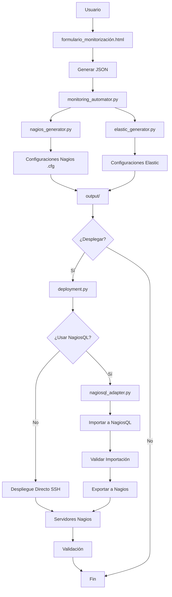

# Sistema de Automatización de Monitorización

🚀 **Sistema completo para automatizar la configuración y despliegue de Nagios y Elastic Stack basado en formularios JSON**

## 🆕 Novedades v1.5 - Integración Optimizada con NagiosQL v3.5.0

- ✅ **Sistema de logging completo** con niveles DEBUG/INFO/WARNING/ERROR
- ✅ **Archivo de log automático** (`monitoring_automator.log`) con rotación
- ✅ **Logging detallado** en todos los componentes del sistema
- ✅ **Trazabilidad completa** de procesos de generación y validación
- ✅ **Descubrimiento automático mejorado** con análisis de respuestas HTTP para inferir tipos de servicio
- ✅ **Plugins dinámicos** para checks personalizados sin modificar código
- ✅ **Integración automática de health checks** detectados en endpoints
- ✅ **Parámetros avanzados** para configuraciones precisas de checks
- ✅ **Despliegue automático** de configuraciones a servidores (v1.1)
- ✅ **Archivo de configuración separado** (`config.yml`) para infraestructura (v1.1)
- ✅ **Soporte multi-entorno** (production, staging, development) (v1.1)
- ✅ **Backup automático** antes de despliegues (v1.1)
- ✅ **Validación post-despliegue** de servicios (v1.1)
- ✅ **Notificaciones** por email/Slack (v1.1)
- ✅ **Modo dry-run** para pruebas seguras (v1.1)
- ✅ **Integración completa con NagiosQL v3.5.0** (v1.5)
- ✅ **Staging automático de archivos** para importación manual (v1.5)
- ✅ **Idempotencia mediante checksums** para evitar duplicados (v1.5)
- ✅ **Validación sintáctica previa** de archivos .cfg (v1.5)
- ✅ **Instrucciones automáticas** para importación manual (v1.5)
- ✅ **Validación post-importación** con comandos específicos (v1.5)
- ✅ **Gestión de backups** automática en directorios de sesión (v1.5)
- ✅ **Sistema de notificaciones** para pasos manuales requeridos (v1.5)
- ✅ **Sesiones trazables** con IDs únicos por importación (v1.5)
- ✅ **Optimización CI/CD** con pasos manuales claros (v1.5)

## 📋 Descripción General

Este sistema permite generar automáticamente configuraciones completas de monitorización para:

- **Nagios**: Hosts, servicios, contactos y comandos de chequeo
- **Elastic Stack**: Filebeat, Logstash, pipelines de procesamiento, dashboards y alertas

Todo basado en un formulario web que genera un JSON estructurado con la información del servicio.

## 📊 Características del Sistema

### Funcionalidades de Nagios

✅ **Configuración automática de:**
- Definición de hosts basada en entornos
- Servicios de monitorización por puerto/protocolo
- Grupos de contactos por responsable
- Comandos de chequeo estándar
- Configuración basada en prioridades e impacto

✅ **Tipos de chequeo soportados:**
- HTTP/HTTPS (para APIs y sitios web)
- TCP (para puertos específicos)
- Ping (para conectividad básica)
- DNS, LDAP, SMTP, SQL (para servicios específicos)

✅ **Integración Optimizada con NagiosQL v3.5.0:**
- **Staging automático de archivos** para importación manual
- **Validación sintáctica previa** de archivos .cfg
- **Idempotencia mediante checksums MD5** para evitar duplicados
- **Instrucciones automáticas** detalladas para importación manual
- **Validación post-importación** con comandos específicos
- **Gestión de backups automática** en directorios de sesión
- **Sistema de notificaciones** para pasos manuales requeridos
- **Sesiones trazables** con IDs únicos por importación

### Funcionalidades de Elastic Stack

✅ **Configuración automática de:**
- **Filebeat**: Inputs para diferentes tipos de logs
- **Logstash**: Pipelines de procesamiento con filtros Grok/JSON
- **Elasticsearch**: Templates de índice y pipelines de ingest
- **Kibana**: Dashboards básicos y configuración de alertas

✅ **Procesamiento de logs:**
- **Texto plano simple**: Parsing con patrones Grok
- **Texto multilínea**: Manejo de stacks traces y logs multilínea
- **JSON estructurado**: Procesamiento directo de JSON
- **Campos personalizados**: Metadata de servicio y entorno


## 🏗️ Arquitectura del Sistema

```
Sistema de Automatización v1.4
├── 📄 formulario_monitorizacion.html    # Formulario web para capturar datos
├── 📄 monitoring_automator.py           # Script principal (generación + despliegue opcional)
├── 📄 nagios_generator.py              # Generador de configs Nagios
├── 📄 elastic_generator.py             # Generador de configs Elastic
├── 📄 validate_configs.py              # Validador de configuraciones
├── 📄 deployment.py                    # 🚀 NUEVO: Despliegue automático
├── 📄 nagiosql_adapter.py              # 🔗 NUEVO: Adaptador NagiosQL
├── 📄 config.yml                       # ⚙️ NUEVO: Configuración de infraestructura
├── 📄 config.yml.example               # 📋 NUEVO: Ejemplo de configuración
├── 📄 monitoring_automator.log         # 📋 NUEVO: Archivo de log automático
├──  output/                          # Configuraciones generadas
├── 📁 logs/                           # Logs del sistema
├── 📄 .gitignore                      # Control de versiones
└── 📄 README.md                        # Esta documentación
```
## 🔄 Diagrama de Flujo




## 🚀 Inicio Rápido

### 1. Preparar el entorno

```bash
# Crear entorno virtual (opcional pero recomendado)
python3 -m venv monitoring_env
source monitoring_env/bin/activate  # Linux/Mac
# o
monitoring_env\Scripts\activate     # Windows

# Instalar dependencias
pip install jinja2 pyyaml paramiko requests mysql-connector-python

# Crear archivo de configuración desde el ejemplo
cp config.yml.example config.yml
# Editar config.yml con tus datos reales de NagiosQL
```

### 2. Configurar infraestructura

```bash
# Copiar archivo de configuración de ejemplo
cp config.yml.example config.yml

# Editar config.yml con tus datos reales (servidores, credenciales, etc.)
nano config.yml  # o tu editor favorito

# Configurar variables de entorno para credenciales
export NAGIOSQL_PASSWORD="tu_password_nagiosql"
export NAGIOSQL_API_KEY="tu_api_key_opcional"
```

### 3. Usar el formulario web

1. Abrir `formulario_monitorizacion.html` en un navegador web
2. Completar todos los campos requeridos:
   - **Identificación del servicio** (nombre, descripción, prioridad)
   - **Tecnologías** utilizadas (Django, Nginx, PostgreSQL, etc.)
   - **Responsables** del servicio (nombre y email)
   - **Dependencias** externas/internas (puertos, protocolos)
   - **Logs** con rutas, formatos y patrones
   - **API de health** (si aplica)
   - **Entornos** y hosts asociados
3. Hacer clic en **"Generar JSON"** para obtener el archivo de configuración

**Nota:** También puedes usar el archivo `service_example.json` incluido como ejemplo para pruebas.

### 4. Generar configuraciones

```bash
# Generar configuración completa (Nagios + Elastic)
python monitoring_automator.py servicio.json

# Generar y desplegar automáticamente
python monitoring_automator.py servicio.json --deploy --deploy-env production

# Generar solo configuración de Nagios
python monitoring_automator.py servicio.json --nagios-only

# Generar solo configuración de Elastic Stack
python monitoring_automator.py servicio.json --elastic-only

# Especificar directorio de salida personalizado
python monitoring_automator.py servicio.json -o /ruta/personalizada

# Desplegar configuraciones existentes
python deployment.py output/execution_20241201_143000/ --env staging

# Desplegar Nagios vía NagiosQL v3.5.0 (staging automático + importación manual)
python deployment.py output/execution_20241201_143000/ --use-nagiosql

# Validar importación manual completada
python deployment.py output/execution_20241201_143000/ --validate-nagiosql-import nagiosql_import_20251028_093700

# Forzar despliegue directo de Nagios (ignorar NagiosQL)
python deployment.py output/execution_20241201_143000/ --skip-nagiosql

# Ver estado de configuraciones generadas
ls -la output/execution_*/nagios/
```

## ⚙️ Configuración Detallada (config.yml)

El archivo `config.yml` define la configuración de infraestructura para el despliegue automático de monitorización. Copia `config.yml.example` a `config.yml` y personalízalo con tus datos reales. A continuación, se explica cada bloque principal:

### 1. **nagios** (Configuración de Nagios)
   - **Propósito**: Define cómo conectar y configurar el servidor de Nagios para desplegar checks y hosts generados.
   - **Subsecciones**:
     - `server`: Detalles del servidor Nagios (host, puerto SSH, usuario, clave SSH, directorios de config y backups). Se usa para conexiones SSH y copiar archivos.
     - `check_commands`: Parámetros globales para comandos de chequeo (timeout, retries, interval). Afecta cómo se generan y ejecutan los checks en Nagios.
   - **Uso**: Esencial para el despliegue automático de configuraciones Nagios generadas por `nagios_generator.py`.

### 2. **nagiosql** (Configuración de NagiosQL v3.5.0 - NUEVO)
    - **Propósito**: Configura la integración optimizada con NagiosQL v3.5.0 para staging automático e importación manual.
    - **Subsecciones**:
      - `integration_method`: Método de integración ('file' para v3.5.0, 'api', 'database', 'none')
      - `host`: Servidor NagiosQL para conexiones SSH
      - `ssh_user`: Usuario SSH para staging de archivos
      - `ssh_key_path`: Ruta a clave privada SSH
      - `import_directory`: Directorio de importación en NagiosQL (/var/lib/nagiosql/import)
      - `backup_directory`: Directorio para backups automáticos
      - `behavior`: Configuración de comportamiento (checksums, backups, validación, notificaciones)
    - **Uso**: Automatiza el staging de archivos .cfg y genera instrucciones para importación manual en NagiosQL.

### 3. **elastic** (Configuración de Elastic Stack)
   - **Propósito**: Configura los componentes de Elasticsearch, Kibana, Logstash y Filebeat para procesar logs y métricas.
   - **Subsecciones**:
     - `elasticsearch`: Hosts, autenticación (con env vars como `${ELASTIC_PASSWORD}`), SSL y timeouts. Se usa para crear pipelines de ingest.
     - `kibana`: Host, puerto y auth para dashboards.
     - `logstash`: Host, puerto y directorio de configs para pipelines de procesamiento.
     - `filebeat`: Targets (servidores remotos) y configs globales para recolectar logs.
   - **Uso**: Permite el despliegue automático de configs Elastic generadas por `elastic_generator.py`, incluyendo pipelines, dashboards y recolectores de logs.

### 4. **general** (Configuración General del Sistema)
   - **Propósito**: Opciones globales que controlan el comportamiento del despliegue.
   - **Campos**:
     - `backup_before_deploy`: Si hacer backup antes de cambios.
     - `validate_after_deploy`: Si validar configs post-despliegue.
     - `dry_run`: Modo simulación (no cambios reales).
     - `log_level`: Nivel de logging (INFO, DEBUG, etc.).
     - `notification_email`: Email para notificaciones.
     - `temp_dir`: Directorio temporal para archivos.
   - **Uso**: Estos flags se chequean para decidir si hacer backups, validar, o ejecutar en dry-run.

### 5. **environments** (Configuración por Entorno)
   - **Propósito**: Define configuraciones específicas para entornos como production, staging, development (e.g., contactos Nagios, prefijos de índices Elastic, severidad de alertas).
   - **Subsecciones**: Cada entorno (production, staging, development) tiene campos como `nagios_contact_group`, `elastic_index_prefix`, `alert_severity`, etc.
   - **Uso**: Se selecciona vía argumento `--env` en `deployment.py`. Permite adaptar el despliegue por entorno sin cambiar el código.

### 6. **security** (Configuración de Seguridad)
   - **Propósito**: Maneja aspectos de seguridad como claves SSH, sudo, y backends de secretos.
   - **Campos**:
     - `ssh_key_passphrase`: Passphrase para claves SSH (si aplica).
     - `sudo_password`: Password para sudo (si no se usa clave).
     - `vault_enabled`: Integración con HashiCorp Vault (no implementada en el código actual).
     - `secrets_backend`: Backend para secretos (env, vault, etc.).
   - **Uso**: Se usa en conexiones SSH para autenticación segura. Actualmente, se basa en env vars para secretos.

### 7. **notifications** (Configuración de Notificaciones)
   - **Propósito**: Define cómo enviar alertas post-despliegue (email, Slack).
   - **Subsecciones**:
     - `email`: SMTP server, puerto, TLS, etc.
     - `slack`: Webhook URL (con `${SLACK_WEBHOOK_URL}`) y canal.
   - **Uso**: Al final del despliegue, envía notificaciones de éxito/fallo.

### 8. **logging** (Configuración de Logging del Sistema de Despliegue)
   - **Propósito**: Controla cómo el script `deployment.py` registra logs (nivel, archivo, formato).
   - **Campos**:
     - `level`: Nivel de log (INFO, etc.).
     - `file`: Ruta al archivo de log (e.g., `logs/deployment.log`).
     - `max_size`, `backups`: Rotación de logs.
     - `format`: Formato de los mensajes.
   - **Uso**: Se configura para logging a archivo y consola.

### Notas Generales sobre Configuración:
- **Variables de Entorno**: Campos como `${ELASTIC_PASSWORD}` se resuelven desde variables de entorno del sistema (e.g., `export ELASTIC_PASSWORD=tu_password`) para evitar hardcodear secretos.
- **Personalización**: Edita `config.yml` con tus valores reales. El código asume que existe este archivo para el despliegue.
- **Integración**: Este config se usa solo en `deployment.py` para el despliegue; `monitoring_automator.py` lo invoca si usas `--deploy`.
- **Seguridad**: Nunca subas `config.yml` a GitHub, ya que contiene credenciales. Usa `config.yml.example` como plantilla.

### 1. **nagios** (Configuración de Nagios)
   - **Propósito**: Define cómo conectar y configurar el servidor de Nagios para desplegar checks y hosts generados.
   - **Subsecciones**:
     - `server`: Detalles del servidor Nagios (host, puerto SSH, usuario, clave SSH, directorios de config y backups). Se usa para conexiones SSH y copiar archivos.
     - `check_commands`: Parámetros globales para comandos de chequeo (timeout, retries, interval). Afecta cómo se generan y ejecutan los checks en Nagios.
   - **Uso**: Esencial para el despliegue automático de configuraciones Nagios generadas por `nagios_generator.py`.

### 2. **elastic** (Configuración de Elastic Stack)
   - **Propósito**: Configura los componentes de Elasticsearch, Kibana, Logstash y Filebeat para procesar logs y métricas.
   - **Subsecciones**:
     - `elasticsearch`: Hosts, autenticación (con env vars como `${ELASTIC_PASSWORD}`), SSL y timeouts. Se usa para crear pipelines de ingest.
     - `kibana`: Host, puerto y auth para dashboards.
     - `logstash`: Host, puerto y directorio de configs para pipelines de procesamiento.
     - `filebeat`: Targets (servidores remotos) y configs globales para recolectar logs.
   - **Uso**: Permite el despliegue automático de configs Elastic generadas por `elastic_generator.py`, incluyendo pipelines, dashboards y recolectores de logs.

### 3. **general** (Configuración General del Sistema)
   - **Propósito**: Opciones globales que controlan el comportamiento del despliegue.
   - **Campos**:
     - `backup_before_deploy`: Si hacer backup antes de cambios.
     - `validate_after_deploy`: Si validar configs post-despliegue.
     - `dry_run`: Modo simulación (no cambios reales).
     - `log_level`: Nivel de logging (INFO, DEBUG, etc.).
     - `notification_email`: Email para notificaciones.
     - `temp_dir`: Directorio temporal para archivos.
   - **Uso**: Estos flags se chequean para decidir si hacer backups, validar, o ejecutar en dry-run.

### 4. **environments** (Configuración por Entorno)
   - **Propósito**: Define configuraciones específicas para entornos como production, staging, development (e.g., contactos Nagios, prefijos de índices Elastic, severidad de alertas).
   - **Subsecciones**: Cada entorno (production, staging, development) tiene campos como `nagios_contact_group`, `elastic_index_prefix`, `alert_severity`, etc.
   - **Uso**: Se selecciona vía argumento `--env` en `deployment.py`. Permite adaptar el despliegue por entorno sin cambiar el código.

### 5. **security** (Configuración de Seguridad)
   - **Propósito**: Maneja aspectos de seguridad como claves SSH, sudo, y backends de secretos.
   - **Campos**:
     - `ssh_key_passphrase`: Passphrase para claves SSH (si aplica).
     - `sudo_password`: Password para sudo (si no se usa clave).
     - `vault_enabled`: Integración con HashiCorp Vault (no implementada en el código actual).
     - `secrets_backend`: Backend para secretos (env, vault, etc.).
   - **Uso**: Se usa en conexiones SSH para autenticación segura. Actualmente, se basa en env vars para secretos.

### 6. **notifications** (Configuración de Notificaciones)
   - **Propósito**: Define cómo enviar alertas post-despliegue (email, Slack).
   - **Subsecciones**:
     - `email`: SMTP server, puerto, TLS, etc.
     - `slack`: Webhook URL (con `${SLACK_WEBHOOK_URL}`) y canal.
   - **Uso**: Al final del despliegue, envía notificaciones de éxito/fallo.

### 7. **logging** (Configuración de Logging del Sistema de Despliegue)
   - **Propósito**: Controla cómo el script `deployment.py` registra logs (nivel, archivo, formato).
   - **Campos**:
     - `level`: Nivel de log (INFO, etc.).
     - `file`: Ruta al archivo de log (e.g., `logs/deployment.log`).
     - `max_size`, `backups`: Rotación de logs.
     - `format`: Formato de los mensajes.
   - **Uso**: Se configura para logging a archivo y consola.

### Notas Generales sobre Configuración:
- **Variables de Entorno**: Campos como `${ELASTIC_PASSWORD}` se resuelven desde variables de entorno del sistema (e.g., `export ELASTIC_PASSWORD=tu_password`) para evitar hardcodear secretos.
- **Personalización**: Edita `config.yml` con tus valores reales. El código asume que existe este archivo para el despliegue.
- **Integración**: Este config se usa solo en `deployment.py` para el despliegue; `monitoring_automator.py` lo invoca si usas `--deploy`.
- **Seguridad**: Nunca subas `config.yml` a GitHub, ya que contiene credenciales. Usa `config.yml.example` como plantilla.

Para más detalles técnicos, revisa el código en `deployment.py` (funciones como `_resolve_env_vars` y `_connect_ssh`).


## 📁 Estructura del JSON de Entrada

El formulario genera un JSON con la siguiente estructura:

### Parámetros Avanzados para Checks

Para una configuración más precisa, puedes incluir parámetros avanzados en `check_params` para cada dependencia. El sistema detecta automáticamente muchos de estos, pero puedes especificarlos manualmente:

#### Ejemplo de Dependencia HTTP con Parámetros Avanzados

```json
{
  "name": "API Principal",
  "type": "API",
  "nature": "Externa",
  "impact": "Crítico",
  "port": "443",
  "check_protocol": "http",
  "effect": "API no responde",
  "check_params": {
    "url": "/api/v1/health",
    "expected_status": 200,
    "timeout": 30,
    "ssl": true,
    "auth_user": "user",
    "auth_pass": "pass"
  }
}
```

#### Parámetros Disponibles por Protocolo

- **HTTP/HTTPS:**
  - `url`: Ruta específica (ej. "/health")
  - `expected_status`: Código de respuesta esperado (por defecto 200)
  - `timeout`: Timeout en segundos (por defecto 30)
  - `ssl`: Usar SSL (true/false)
  - `auth_user` / `auth_pass`: Credenciales básicas

- **TCP:**
  - `timeout`: Timeout en segundos
  - `send`: String a enviar
  - `expect`: Respuesta esperada
  - `ssl`: Usar SSL

- **Docker/Kubernetes:**
  - `container_name`: Nombre del contenedor
  - `check_type`: Tipo de check (running, status)
  - `resource_type`: Tipo de recurso (service, pod)

#### Descubrimiento Automático Mejorado

El sistema ahora analiza respuestas HTTP para inferir tipos de servicio y detectar endpoints de health automáticamente. Por ejemplo:
- Detecta si es un servidor web (Nginx, Apache) basado en headers y contenido
- Identifica APIs JSON y ajusta `expected_status`
- Encuentra endpoints de health como `/health`, `/status` y los incluye en `check_params`

#### Plugins Dinámicos

Puedes agregar nuevos tipos de checks creando archivos `.py` en `plugins/checks/`. El sistema los carga automáticamente si la clase hereda de `BaseCheck`. Ejemplo de plugin personalizado:

```python
from plugins.checks.base import BaseCheck

class MQTTCheck(BaseCheck):
    def get_required_params(self) -> list:
        return ['port', 'topic']

    def get_nagios_command(self, dependency_config: Dict[str, Any]) -> str:
        # Implementar comando personalizado
        return f"check_mqtt -H {dependency_config['host_address']} -p {dependency_config['port']}"
```

```json
{
  "identification": {
    "service_name": "Nombre del servicio",
    "service_desc": "Descripción funcional",
    "priority": "Crítica|Alta|Media|Baja"
  },
  "tech_stack": [
    {
      "technology": "Django",
      "version": "5.2.3"
    }
  ],
  "responsables": [
    {
      "nombre": "Responsable Técnico",
      "email": "responsable@empresa.com"
    }
  ],
  "dependencies": [
    {
      "name": "Base de datos",
      "type": "Base de datos",
      "nature": "Interna",
      "impact": "Crítico",
      "port": "5432",
      "check_protocol": "tcp",
      "effect": "Usuarios no pueden acceder a datos"
    }
  ],
  "logs": [
    {
      "name": "aplicacion.log",
      "path": "/var/log/aplicacion/aplicacion.log",
      "format": "Texto plano simple",
      "retention_method": "tamano",
      "retention_value": "10MB, 5 backups",
      "patterns": [
        "[TIMESTAMP] LEVEL [MODULE:LINE] FUNCTION - User:USERNAME IP:IP_ADDRESS Action:ACTION - MESSAGE"
      ]
    }
  ],
  "envs": [
    {
      "name": "PROD",
      "desc": "Producción",
      "location": "Datacenter Principal",
      "hosts": [
        {
          "type": "container",
          "identifier": "web-app-01"
        }
      ]
    }
  ]
}
```

## 🔧 Configuración de Salida

### Archivos Generados para Nagios

```
output/execution_YYYYMMDD_HHMMSS/
├── nagios/
│   ├── hosts.cfg          # Definición de hosts
│   ├── services.cfg       # Servicios de monitorización
│   ├── contacts.cfg       # Grupos de contactos
│   ├── commands.cfg       # Comandos de chequeo
│   └── nagios.cfg         # Configuración principal
└── README.md              # Reporte detallado
```

### Archivos Generados para Elastic Stack

```
output/execution_YYYYMMDD_HHMMSS/
├── elastic/
│   ├── filebeat.yml       # Configuración de Filebeat
│   ├── logstash.conf      # Configuración de Logstash
│   ├── ingest_pipeline.json  # Pipeline de Elasticsearch
│   ├── index_template.json   # Template de índices
│   ├── kibana_dashboard.json # Dashboard básico
│   └── alerts.json        # Configuración de alertas
└── README.md              # Reporte detallado
```

## 📋 Despliegue de Configuraciones

### Opción 1: Despliegue Automático (Recomendado)

```bash
# Despliegue completo automático
python monitoring_automator.py servicio.json --deploy --deploy-env production

# O en dos pasos:
python monitoring_automator.py servicio.json  # Generar configs
python deployment.py output/execution_*/ --env production  # Desplegar

# Despliegue con NagiosQL v3.5.0 (staging automático + importación manual)
python deployment.py output/execution_*/ --use-nagiosql --env production
```

### Opción 2: Despliegue Manual

#### Nagios
```bash
# 1. Copiar archivos de configuración
sudo cp output/execution_*/nagios/*.cfg /etc/nagios/objects/

# 2. Verificar sintaxis
sudo nagios -v /etc/nagios/nagios.cfg

# 3. Reiniciar servicio
sudo systemctl restart nagios

# 4. Verificar en interfaz web
# Abrir http://nagios-server/nagios
```

#### Elastic Stack
```bash
# 1. Filebeat
sudo cp output/execution_*/elastic/filebeat.yml /etc/filebeat/
sudo systemctl restart filebeat

# 2. Logstash
sudo cp output/execution_*/elastic/logstash.conf /etc/logstash/conf.d/
sudo systemctl restart logstash

# 3. Elasticsearch (ejecutar vía API)
curl -X PUT "localhost:9200/_ingest/pipeline/PIPELINE_NAME" \
  -H 'Content-Type: application/json' \
  -d @output/execution_*/elastic/ingest_pipeline.json

# 4. Kibana - Importar dashboard manualmente
```

## 🛠️ Personalización Avanzada
### Integración con NagiosQL

#### Configuración Optimizada para NagiosQL v3.5.0

Para NagiosQL v3.5.0, el método recomendado es `file` con staging automático:

```yaml
nagiosql:
  # Método optimizado para v3.5.0
  integration_method: "file"

  # Configuración SSH para staging
  host: "tu-servidor-nagiosql"
  ssh_user: "nagios"
  ssh_key_path: "~/.ssh/nagiosql_key"
  import_directory: "/var/lib/nagiosql/import"
  backup_directory: "/var/lib/nagiosql/backup"

  # Configuración de comportamiento
  behavior:
    use_checksums: true          # Idempotencia
    create_backups: true         # Backups automáticos
    validate_syntax: true        # Validación previa
    notifications_enabled: true  # Notificaciones para pasos manuales
    notification_recipients:
      - "admin@empresa.com"
      - "#monitoring-alerts"  # Slack channel
```

#### Métodos de Integración Alternativos

Para versiones futuras de NagiosQL con API:

1. **API REST** (cuando esté disponible):
   ```yaml
   nagiosql:
     integration_method: "api"
     api:
       url: "http://nagiosql.example.com"
       username: "api_user"
       password: "${NAGIOSQL_PASSWORD}"
       verify_ssl: true
   ```

2. **Base de Datos Directa** (solo si tienes acceso directo):
   ```yaml
   nagiosql:
     integration_method: "database"
     database:
       host: "localhost"
       user: "nagiosql_user"
       password: "${NAGIOSQL_DB_PASSWORD}"
       database: "nagiosql"
   ```

#### Configuración de Comportamiento

```yaml
nagiosql:
  behavior:
    use_checksums: true          # Idempotencia mediante checksums
    update_existing: true        # Actualizar objetos existentes
    create_backups: true         # Backup antes de cambios
    validate_after_import: true  # Validar importación
    auto_export_to_nagios: true  # Exportar automáticamente a Nagios
```

#### Uso del Adaptador NagiosQL v3.5.0

```python
from nagiosql_adapter import create_nagiosql_adapter

# Configurar adaptador para v3.5.0
config = {
    'integration_method': 'file',  # Optimizado para v3.5.0
    'host': 'tu-servidor-nagiosql',
    'ssh_user': 'nagios',
    'ssh_key_path': '~/.ssh/nagiosql_key',
    'import_directory': '/var/lib/nagiosql/import',
    'backup_directory': '/var/lib/nagiosql/backup',
    'use_checksums': True,
    'create_backups': True,
    'validate_syntax': True,
    'notifications_enabled': True,
    'notification_recipients': ['admin@empresa.com']
}

adapter = create_nagiosql_adapter(config)

# Staging automático de configuraciones
config_files = {
    'hosts.cfg': contenido_hosts,
    'services.cfg': contenido_services,
    'contacts.cfg': contenido_contacts,
    'commands.cfg': contenido_commands
}

# Esto hace staging automático y genera instrucciones
success = adapter.import_configurations(config_files)
# Resultado: archivos preparados + instrucciones para importación manual

# Después de completar importación manual en NagiosQL:
adapter.validate_post_import()  # Valida que la importación fue exitosa
```

#### Solución de Problemas con NagiosQL v3.5.0

- **Error de conexión SSH**: Verificar clave privada, permisos y conectividad al servidor NagiosQL
- **Archivos no encontrados**: Verificar rutas de `import_directory` y `backup_directory`
- **Permisos insuficientes**: El usuario SSH debe tener permisos de escritura en directorios de importación
- **Sintaxis inválida**: Los archivos .cfg generados tienen errores - revisar logs de validación
- **Duplicados**: Checksums detectaron archivos modificados - revisar conflictos de idempotencia
- **Importación manual fallida**: Seguir exactamente las instrucciones generadas automáticamente


### Modificar Patrones de Logs

Para personalizar el procesamiento de logs, edita la función `_create_grok_pattern()` en `elastic_generator.py`:

```python
def _create_grok_pattern(self, log_patterns):
    # Personalizar patrones según necesidades específicas
    custom_patterns = {
        "timestamp": "%{YEAR}-%{MONTHNUM}-%{MONTHDAY} %{TIME}",
        "loglevel": "(INFO|DEBUG|WARN|ERROR|FATAL)",
        # Agregar patrones personalizados
    }
    return " ".join(pattern_parts)
```

### Agregar Nuevos Tipos de Chequeo

Para agregar nuevos protocolos de chequeo en Nagios, modifica el diccionario `protocol_commands` en `nagios_generator.py`:

```python
self.protocol_commands = {
    "http": "check_http",
    "tcp": "check_tcp",
    "icmp": "check_ping",
    "dns": "check_dns",
    "nuevo_protocolo": "check_custom_command"
}
```

## 🔍 Solución de Problemas

### Problemas Comunes

**Error: "No se encontró el archivo JSON"**
- Verificar que la ruta al archivo sea correcta
- Usar rutas absolutas si es necesario

**Error: "Error de formato JSON"**
- Validar que el JSON generado por el formulario sea válido
- Revisar que no haya caracteres especiales no escapados

**Error: "Módulo jinja2 no encontrado"**
```bash
pip install jinja2 pyyaml
```

**Configuración de Nagios no se aplica**
- Verificar permisos de archivos: `sudo chown nagios:nagios /etc/nagios/objects/*.cfg`
- Revisar logs de Nagios: `tail -f /var/log/nagios/nagios.log`

### Sistema de Logging

El sistema incluye logging completo para depuración y monitoreo:

#### Archivo de Log Automático
- **Ubicación**: `monitoring_automator.log` (creado automáticamente)
- **Formato**: Timestamp, nivel, módulo, mensaje
- **Rotación**: Archivo único con sobrescritura automática

#### Niveles de Logging
- **DEBUG**: Información detallada de procesos internos
- **INFO**: Eventos principales y progreso
- **WARNING**: Advertencias y configuraciones incompletas
- **ERROR**: Errores que impiden la ejecución

#### Componentes con Logging
- **MonitoringAutomator**: Validación JSON, generación de configs
- **NagiosGenerator**: Creación de hosts, servicios, contactos
- **CheckManager**: Carga de plugins, generación de comandos
- **ServiceDiscovery**: Auto-detección de servicios

#### Ejemplo de Salida de Log
```
2025-10-27 08:27:43,123 - CheckManager - INFO - CheckManager inicializado con 6 checks disponibles
2025-10-27 08:27:44,362 - MonitoringAutomator - INFO - Validando archivo JSON: gesform.json
2025-10-27 08:27:44,369 - MonitoringAutomator - INFO - Servicio identificado: Gestión de formación (Prioridad: Baja)
2025-10-27 08:27:44,380 - NagiosGenerator - INFO - Generando configuración de servicios...
```

#### Configuración de Logging
El logging se configura automáticamente al ejecutar el sistema. Para personalizar:

```python
# En monitoring_automator.py
logging.basicConfig(
    level=logging.DEBUG,  # Cambiar nivel según necesidad
    format='%(asctime)s - %(name)s - %(levelname)s - %(message)s',
    handlers=[
        logging.FileHandler('monitoring_automator.log'),
        logging.StreamHandler(sys.stdout)
    ]
)
```

## 🔒 Seguridad y GitHub

### Archivos Seguros para Subir

✅ **Archivos que SÍ se pueden subir a GitHub:**
- `formulario_monitorización.html`
- `monitoring_automator.py`
- `nagios_generator.py`
- `elastic_generator.py`
- `validate_configs.py`
- `deployment.py`
- `test_system.py`
- `README.md`
- `.gitignore`
- `logs/.gitkeep`
- `config.yml.example`
- `service_example.json`
- `monitoring_automator.log` (se genera automáticamente, útil para debugging)

### ❌ Archivos que NUNCA deben subirse

- `config.yml` (contiene credenciales reales)
- Cualquier archivo con passwords, keys, certificados
- Datos específicos de producción
- Información sensible de la empresa

### Configuración Inicial

```bash
# 1. Clonar el repositorio
git clone https://github.com/tu-usuario/monitoring-automation.git
cd monitoring-automation

# 2. Configurar entorno
python3 -m venv monitoring_env
source monitoring_env/bin/activate  # Linux/Mac
pip install jinja2 pyyaml paramiko requests

# 3. Configurar infraestructura
cp config.yml.example config.yml
# Editar config.yml con tus datos reales

# 4. Probar con datos de ejemplo
python monitoring_automator.py service_example.json
```

## 📈 Mejoras Futuras

- [x] **Mejorado:** Sistema de logging completo para depuración
- [x] **Mejorado:** Descubrimiento automático de servicios con análisis de respuestas HTTP
- [x] **Mejorado:** Soporte para plugins dinámicos de checks
- [x] **Mejorado:** Integración automática de endpoints de health
- [x] **Completado:** Integración optimizada con NagiosQL v3.5.0 (staging automático + importación manual)
- [ ] Soporte para Zabbix como alternativa a Nagios
- [ ] Generación automática de dashboards avanzados en Kibana
- [ ] Integración con Ansible para despliegue automatizado
- [ ] Soporte para métricas personalizadas (Prometheus)
- [ ] Interfaz web para el sistema de automatización
- [ ] Validación automática de configuraciones generadas
- [ ] Integración CI/CD completa con approval workflows para pasos manuales

## 🤝 Contribución

Para contribuir al proyecto:

1. Fork el repositorio
2. Crear rama para nueva funcionalidad: `git checkout -b feature/nueva-funcionalidad`
3. Commit cambios: `git commit -am 'Agregar nueva funcionalidad'`
4. Push rama: `git push origin feature/nueva-funcionalidad`
5. Crear Pull Request

## 📄 Licencia

Este proyecto está bajo la licencia MIT. Ver archivo `LICENSE` para más detalles.


---

**Desarrollado por:** Equipo de Monitorización y Observabilidad
**Versión:** 1.5.0
**Última actualización:** Octubre 2025