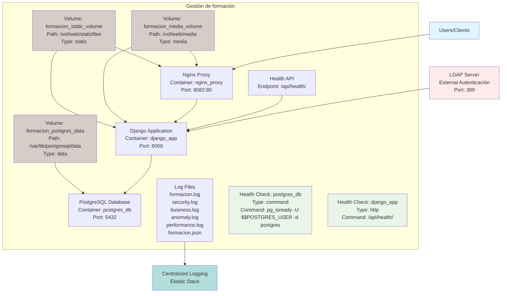

# Architecture Diagram: Gestión de Formación

Based on the JSON configuration, here's the system architecture diagram:

> **Note**: To view the Mermaid diagram, ensure your Markdown viewer supports Mermaid rendering. In VS Code, install the "Markdown Preview Mermaid Support" extension or use an online Mermaid editor.

## Architecture Overview

### Main Components
- **Nginx Proxy**: Acts as a reverse proxy and load balancer, port 8082:80
- **Django Application**: Core business logic, port 8000
- **PostgreSQL Database**: Primary data storage, port 5432
- **LDAP Server**: External authentication service, port 389

### Dependencies
- **LDAP (Authentication)**: External dependency for user authentication
- **PostgreSQL (Database)**: Internal critical dependency for data persistence
- **Django (Backend)**: Self-dependency for the application itself

### Storage and Volumes
- **Volumes**: Persistent storage for static files, media, and database data
  - formacion_static_volume: /vol/web/staticfiles (static files)
  - formacion_media_volume: /vol/web/media (user media)
  - formacion_postgres_data: /var/lib/postgresql/data (database data)

### Health Checks and Monitoring
- **Health Checks**: Automated checks for service availability
  - PostgreSQL: Command-based check (pg_isready)
  - Django: HTTP-based check (/api/health/)
- **Health API**: Provides system health status via HTTP endpoint
- **Centralized Logging**: All logs are sent to Elastic Stack for analysis and retention

### Networking
- **Ports**: 8082:80 (Nginx), 8000:8000 (Django), 5432:5432 (PostgreSQL)
- **Configuration**: Hostname set to gesform.local

### Environment
- **EXP (Production)**: Single production environment with Docker Compose orchestration
- **Hosts**: Three main containers (nginx_proxy, django_app, postgres_db) running on xwiki.contactel.es

### System Boundary
The main application system "Gestión de formación" is grouped in a bounded box, containing:
- **Nginx Proxy** - entry point
- **Django Application** - core business logic
- **PostgreSQL Database** - data storage
- **Health API** - health check endpoint
- **Log Files** - application logs
- **Volumes** - persistent storage
- **Health Checks** - monitoring checks

### Data Flow
1. Users access the system through Nginx
2. Nginx forwards requests to Django application
3. Django interacts with PostgreSQL for data and LDAP for authentication
4. Health API provides system status
5. Logs are centralized for analysis
6. Volumes ensure persistent storage for files and data

This architecture represents the "Gestión de formación" system as defined in the JSON configuration, showing the main application components, dependencies, storage, monitoring, and logging infrastructure for comprehensive automated monitoring.